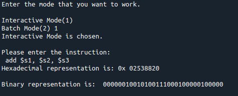

# MIPS_Assembler
MIPS Archtecture Assembler written in Python Language

The interactive mode reads an instruction from command line, assembles it to hexadecimal
(converting from pseudo-instruction as necessary), and outputs the result to the screen. The batch
mode reads a source file with extension .src, assembles to hexadecimal, and outputs the result to
an object code file with extension .obj.

lookuptable.txt includes the operation that this assembler support. You can add/remove instructions here.
input.src includes code example to check whether assembler is working or not

The sample output:

